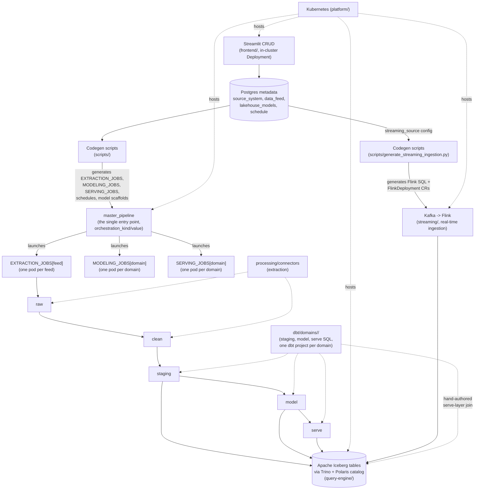

# data-platform

A metadata-driven lakehouse platform: Dagster orchestrates extraction and dbt/Trino transformations over Apache Iceberg tables, all running on Kubernetes — Dagster's own webserver/daemon, the Streamlit CRUD frontend, Postgres, Trino/Polaris/MinIO, and every pipeline run all run as real in-cluster workloads, not local processes. The goal is that onboarding a new source or table is mostly a matter of configuring metadata and writing business logic — not writing platform code.

This README is the full architecture and design reference — durable facts about what the system is and why it's built this way. `Roadmap.md` tracks phase status and what's not yet built, `Progress.md` is the chronological build/verification record, `Backlog.md` is deferred items, and `Learnings.md` is problem-indexed technical gotchas — those four are working documents for this project's build-out and not meant to outlive it; this file is.

This is an enterprise data platform, built locally to validate the feasibility of its components — dbt-driven transformations over Apache Iceberg tables, orchestrated by Dagster, running on Kubernetes — before committing them to a real deployment target. It's architecturally realistic, not a toy, while keeping initial cost/complexity down by running entirely locally (a kind cluster, local filesystem storage) with a deliberate design so the storage layer can later be repointed at real Azure Storage (ADLS Gen2) via config change, not a rewrite.

## Architecture




## Layer Model

Four storage layers, one chain per feed: **raw** (raw extraction from source) → **clean** (schema-validated + pre-processing such as json flattening) → **staging** (cumulative, upserted by business key) → **model** (Kimball facts/dimensions, SCD1/SCD2) → **serve** (user-facing views).

- **raw**: destination for extracted data from sources as-is. Files are stored under a watermarked path per feed `raw/<feed>/YYYY/MM/DD/HH/MM/SS/<feed>.parquet`. The file format matches the source where possible, otherwise defaults to parquet.

- **clean**: cleaned / parsed and schema-validated output of a single run. Iceberg format, but a **snapshot per run, not cumulative** — each run overwrites clean's content for that feed.

- **staging**: cumulative **upsert** Iceberg layer. Each run's clean snapshot is merged into staging using the shared hash-based pattern — `ON target._key_hash = source._key_hash`, `UPDATE` only fires when `_attr_hash` actually differs — so staging holds the latest known state per key across all runs, and an unchanged row from `clean` produces zero writes.

- **model**: Kimball facts + dimensions. Dimensions are configurable **Type 1 (overwrite) or Type 2 (versioned)** per `lakehouse_models`, with updates and deletions each independently toggleable — see "Model Layer: SCD Design" below. Facts are incremental merge/insert models joined to dimension surrogate keys.

- **serve**: views over model — a **latest** (current-state) and **historical** (full version history, Type 2 only) view per model table are generated automatically. Users can create additional views for their consumption.

**dbt project scope**: dbt owns **staging → model → serve**, one project per domain (`dbt/domains/<domain>/`, see "Repo Structure"). Extraction (source → raw → clean: fetch, parse, schema-validate) is one `EXTRACTION_JOBS[feed]` job — generic connector code (`processing/connectors/`, `processing/raw_to_clean/`) orchestrated by Dagster, not dbt — since raw isn't a clean queryable Iceberg source. `clean` is registered as a dbt source per domain.

**Serve layer approach**: a build-time codegen script (`scripts/generate_serve_views.py`) reads `lakehouse_models` metadata and renders Jinja-templated `_latest.sql`/`_historical.sql` dbt view models into each domain's `dbt/domains/<domain>/models/serve/generated/`.

**Streaming (`streaming/` module) is serve-only by design**: a Kafka → Flink pipeline lands each topic as a plain append-only Iceberg table in the same Polaris-cataloged warehouse, queryable by ordinary dbt/Trino SQL with no new integration. Streaming (Kafka, Flink) and batch (Dagster, dbt, Trino) are intentionally separate mechanisms serving hot and cold usage paths, respectively. If a real need for batch to periodically absorb streaming data ever comes up, it's a new batch source reading from `streaming.*` like any other source, not a fold-in.

## Model Layer: SCD Design (Type 1 vs Type 2, Updates, Deletions)

Every model-layer table — facts, Type 1 dimensions, Type 2 dimensions — carries the same seven technical columns, aligned by name across both mechanisms via dbt snapshot's `snapshot_meta_column_names` config, so Type 1 and Type 2 tables are structurally identical and differ only in how the columns get populated:

- `_key_hash` — a hash of the business key column(s), computed by a shared macro. Used as the match/join condition for every merge in the platform (clean→staging, Type 1, Type 2's snapshot `unique_key`) — a single-column comparison regardless of whether the underlying business key is one column or five.
- `_attr_hash` — a hash of the columns that should trigger a change when they differ (see "Hash-based change detection" below — the source column list differs slightly between staging and the model layer). Gates whether a merge's `UPDATE` branch does anything at all, and is the sole `check_cols` value for Type 2 snapshots.
- `_scd_id` — version-specific surrogate key; what fact tables join against for point-in-time correctness on Type 2 dimensions.
- `_valid_from`, `_valid_to` — version lifecycle (`_valid_to IS NULL` = current row). Type 1 tables always have `_valid_to = NULL` — no history is kept, so it's structurally present but never populated.
- `_updated_at` — last time the row was touched.
- `_is_deleted` — boolean. Ordinary tracked data, not a platform-inferred signal — see deletion mechanism below.

**Hash-based change detection, reused identically everywhere a merge happens** (clean→staging, Type 1 dimensions, Type 2 snapshots, mutable facts): a shared macro computes `_key_hash` and `_attr_hash` for any model from metadata, so there's no per-table hand-written hashing or comparison logic — just a matter of telling the macro which columns are keys and which aren't. Two different "non-key" sources feed `_attr_hash` depending on the layer, and it's worth being precise about which: at **staging**, `_attr_hash` is computed from *every* column except `data_feed.business_key_columns` (staging just wants to know "did anything about this record change," full stop). At the **model layer**, `_attr_hash` is computed from the explicitly curated `model_feed.tracked_columns` plus `is_deleted` — a deliberately narrower set, since which attribute changes should actually trigger a new SCD2 version is a modeling decision, not "anything in the row." No new metadata fields are needed for any of this — it's a new way of *using* `business_key_columns`/`tracked_columns`, which already exist.


**`lakehouse_models` carries three flags that together determine merge behavior:**
- `scd_type` (1 or 2) — *how* a change is applied: in place (1) or as a new version (2).
- `updates_enabled` (boolean) — *whether* attribute changes are detected/applied at all. If false, the feed is insert-only: matched rows are left untouched on merge, and `scd_type` is moot.
- `deletes_enabled` (boolean) — *whether* missing-row deletion detection runs. Valid only when the source `data_feed.extraction_type = 'full'` (validated at config-save time, not a DB constraint) — "missing from this load" only implies "deleted" when the load is a complete snapshot, not an incremental slice.

**Implementation per `scd_type`:**
- **Type 2** — a dbt **snapshot**, `check` strategy, `check_cols: ['_attr_hash']`, `unique_key: '_key_hash'`. A change to `_attr_hash` — which folds in `is_deleted` flipping true — closes the current version's `_valid_to` and inserts a new current version; an unchanged `_attr_hash` produces no new version at all. dbt's `hard_deletes` config is deliberately unused (left at default `ignore`): `hard_deletes: new_record` isn't confirmed supported on `dbt-trino`, and it isn't needed anyway since deletion is just another `_attr_hash`-changing update.
- **Type 1** — a plain `incremental` model, `merge` strategy: `MERGE ... ON target._key_hash = source._key_hash WHEN MATCHED AND target._attr_hash != source._attr_hash THEN UPDATE SET <tracked columns>, is_deleted = source.is_deleted, _attr_hash = source._attr_hash, _updated_at = now() WHEN NOT MATCHED THEN INSERT`. One statement, in place, no history, no write at all for rows whose `_attr_hash` hasn't changed.

**Deletion mechanism — a deletion is synthesized as an update, not detected as a special case.** For a `deletes_enabled` feed, an intermediate model (`int_<feed>_with_deletes.sql`) sits between staging and the snapshot/incremental model. It finds business keys present in the model's current rows but absent from this run's full staging load, synthesizes an `is_deleted=true` row for each (attributes carried over from the last known state), and unions those rows into the effective source. From the snapshot/merge's perspective, a deletion is indistinguishable from a normal attribute update — the same single mechanism handles both. This intermediate model exists only for feeds with `deletes_enabled=true`; other feeds read directly from staging.

## Incremental Loading & Watermarks

Two independent watermark scopes:

- **Source extraction** (`data_feed`): `watermark_column` names the source column driving incremental pulls (only meaningful when `extraction_type = 'incremental'`; enforced by a table constraint). `last_watermark_value` is denormalized onto `data_feed` for fast lookup by the orchestrator. Per-run history (one wide row per feed-run, including `raw_watermark_value_start`/`end` and the equivalent pair for every other stage) lives in `data_processing_runs` — there is no separate dedicated run-history table.
  - **`storage_watermark`**: a separate column on `data_processing_runs`, pinning *which* raw folder path (`YYYY/MM/DD/HH/MM/SS`) a given run's data actually lives at — not to be confused with `raw_watermark_value_start`/`end` above (the source's own incremental-pull watermark values, a different concept). Generated once, at run-creation time, by `record_run_started()` — idempotent, since `_ensure_run`'s upsert never overwrites it on a retried call. The raw-writing and clean-reading steps both read it back via their own `log_data_feed_stage(...)` call (`IngestionStepLog.storage_watermark`, returned by the same `UPDATE ... RETURNING` that already looks the row up — no extra query), rather than relying on Dagster run-id parity between the two steps of one job. See `raw_storage.py`.
- **Staging → model merge** (`lakehouse_models`): `watermark_column`/`last_watermark_value` control which staging rows are considered for the next merge. This optimization only benefits feeds *without* `deletes_enabled`: deletion detection requires comparing the full current staging snapshot against the model's current rows regardless, so deletion-tracking feeds do a full scan every run irrespective of this watermark.

## Metadata Schema (Postgres, `platform_metadata` DB)

The full table-by-table schema (columns, constraints, purpose, and join/lookup relationships) lives in [metadata/DataModel.md](metadata/DataModel.md) — that file is the source of truth; this section intentionally doesn't duplicate it to avoid drift.

Tables: `source_system`, `data_feed`, `schema_registry`, `lakehouse_models` (fact/dim config — staging itself has no metadata row, it's naming-convention-only), `load_type` (lookup), `ingestion_triggers` (schedule or sensor metadata for a feed/model's `master_pipeline` trigger — codegen'd into real Dagster `ScheduleDefinition`/`SensorDefinition` objects by `scripts/generate_dagster_pipeline.py`), `data_processing_runs` (one wide row per feed-run or model-run per job execution, spanning raw→clean→staging→model→serve).

This same Postgres instance also hosts `polaris_db` for Apache Polaris (the Iceberg REST catalog).

## Master Pipeline Architecture

Every batch or model run goes through the same four standard stages — extraction, validation, transformation, serving — each a "child pipeline" with its own technology and (by default) zero required user code. Governing principle: standard, metadata-driven stages require zero hand-written user code by default; the one place users are expected to write logic is transformation (staging authorship, and — only when truly necessary — a non-default PyIceberg escape hatch for logic too complex for SQL, see `Backlog.md`).

- **Extraction** (source → raw) — the only stage that ever connects to a data source. `processing/connectors/` (`PostgresConnector`/`CSVConnector`/`RestConnector`/`JsonFileConnector`), driven by `source_system.connector_kind`/`connection_config` plus `data_feed.source_object_name`/`extraction_config`. Onboarding a second source of an already-covered kind needs metadata rows only; genuinely bespoke fetch logic (a REST source's own pagination, a nested source's flattening) needs a small per-feed connector subclass. **Also owns schema discovery** (`infer_column_definitions()`, `PostgresMetadataResource.sync_schema_registry()`) — establishes the contract validation checks against. `clean` is validation's read-only input, never written by anything but extraction; for REST/JSON connector kinds specifically, extraction performs the `clean`-layer write itself too, reusing the one flattened DataFrame rather than flattening the source twice.
- **Validation** (raw → clean) — schema coercion against the contract extraction already established (`raw_to_clean.reconcile_schema()`: all-null-cast, missing-column-fail only). Standard, metadata-driven, zero user code. JSON flattening is genuinely bespoke per nested source, not a generic reusable module — it lives in extraction's per-feed connector subclass, not here.
- **Transformation** (clean → staging → model) — dbt/Trino, the default and the path essentially every feed uses: the shared `row_hash()`/`classify_changes()` macros, dbt's native `check`-strategy snapshot machinery for Type 2 (see "Model Layer: SCD Design" above). This is the one stage users are actively involved in.
- **Serving** (model → serve) — `generate_serve_views.py`, auto-generated `_latest`/`_historical` views (see "Layer Model" above).

**Cherry-picking**: a feed/model can be configured to stop at any stage (extraction-only, through clean only, skip serving, etc.) rather than always running the full chain. `pipeline_steps` lookup table (`0=extraction, 1=validation, 2=transformation, 3=serving`) plus `data_feed.pipeline_steps`/`lakehouse_models.pipeline_steps` comma-separated columns, resolved differently per level: `data_feed.pipeline_steps` resolves **live, per run**, via `pipeline_init_<feed>` (the master pipeline's real entry point, below) — every stage-owning asset downstream checks membership before doing real work, skipping cleanly (not failing) when its step isn't selected. `lakehouse_models.pipeline_steps` only gates that model's serving views, resolved at **codegen time** by `generate_serve_views.py` — a model has no independent Dagster asset of its own to gate live against, unlike a feed.

**ODS (Operational Data Store) layer**: a feed that never gets a hand-modeled dimension/fact (`data_feed.ods_enabled`) gets an automatic Type 1 `staging`+`model` layer instead — `clean` data pushed through as-is (no casts), driven purely by `schema_registry`. Silently ignored if the feed already owns any `lakehouse_models` rows — those always take precedence. Still gets standard `_latest`/`_historical` serve views generated for it, same as a hand-modeled table — consumers must never touch `model` directly either way. **Primary key precedence**: `data_feed.source_pk` is the source of truth at all times if populated, otherwise schema discovery will attempt to infer a PK from the source (for sources such as databases that provided that information via system tables); if neither is populated, then the ODS table is insert-only. Insert-only branches on `extraction_type`: `incremental` stays a plain append (each run's `clean` is genuinely new data); `full` uses `materialized='table'` (a full replace every run, mirroring `clean`'s own atomic-overwrite semantics) — a plain append on a full-load, no-key feed would duplicate every previously-seen row every run.

**`master_pipeline`** is the single entry point every trigger path (schedule, sensor, or a manual launch) goes through, parameterized by `orchestration_kind` (`"batch_group"`/`"model_schema"`) and `orchestration_value` — everything else (which feeds/domains, which steps) is derived live from Postgres inside its own op, not baked into the trigger. It launches three independent child job types, each its own top-level Dagster run with its own pod directly from `K8sRunLauncher` — never a pod spawning a child pod: `EXTRACTION_JOBS[feed]` (`raw`+`clean`, bundled since raw exists only to feed clean), `MODELING_JOBS[domain]` (`staging`+`model`), `SERVING_JOBS[domain]` (`serve`). `data_processing_runs` is keyed by the master's own `master_dagster_run_id`, with each child job threading its own separate `dagster_run_id` back into its own column. Dagster's webserver/daemon/code-server and the Streamlit frontend all run as real in-cluster `Deployment`s (`orchestration/k8s/`, `frontend/k8s/`), reachable via NodePort the same way Postgres/Trino/Polaris/MinIO already are — each domain also gets its own Docker image, built from the same discover-domains-from-Postgres flow `generate_domain_projects.py` uses.

**Cooperative wake-up from KEDA scale-to-zero**: `orchestration`'s webserver/code-server can be scaled to 0 outside configured schedule windows (see "Kubernetes Hosting Model" below). A manual trigger (Streamlit's "Trigger Pipeline" page, `frontend/dagster_wake.py`) wakes them itself via the Kubernetes API before submitting, rather than failing — but never sleeps them back down itself, since `master_pipeline`'s own run pod calls back into the webserver's GraphQL API for its entire duration, not just at submission. Sleep is owned instead by a Dagster run-status sensor (`wake_sleep_sensor.py`) that only unpauses once the triggering run reaches a terminal status *and* a wake-timestamp grace period has elapsed — the grace period exists because a stale sensor tick for an unrelated older run can otherwise fire in the gap between a fresh wake and the new run actually existing in Dagster's run storage, killing the just-woken pod. Every caller of the wake mechanism (Streamlit's Python client and the project's own `_wake-orchestration` shell tooling) stamps the same grace-period timestamp annotation.

## Kubernetes Hosting Model

One kind cluster for the whole platform — not split across multiple clusters. Modules are separated by **namespace** (`metadata`, `orchestration`, `processing`, `query-engine`, `frontend`, `streaming`, `keda`), and within a namespace, workloads split by lifecycle, not by module:

- **Long-running services** (Postgres, Apache Polaris, Trino, Dagster webserver+daemon, Streamlit, Kafka, the Flink Kubernetes Operator) — `Deployment`/`StatefulSet` + `Service`, always up (subject to KEDA scale-to-zero for `orchestration`'s webserver/code-server — see "Kubernetes scaling options compared" in `Learnings.md`).
- **On-demand compute** (a dbt run, a `FlinkDeployment`'s own job pods, an isolated streaming test) — `Job`/`FlinkDeployment` CR, launched per run (by Dagster's `K8sRunLauncher`, `flink::start`, or `streaming-testing::test`), runs to completion (or continuously, for a `FlinkDeployment`), pod disappears when killed. dbt has no server component; it's a CLI invoked inside a pod on demand. Python extraction/validation work (Polars) runs inline inside the same `EXTRACTION_JOBS[feed]` op pod, not as a separate compute resource.

Each module gets at most one container image it owns (custom-built where the module has its own code; off-the-shelf where it doesn't) — **`orchestration` and `streaming` are exceptions with *more* than one** (multiple images from one Dockerfile, or several Dockerfiles), and **`processing`/`dbt` are the opposite exception: zero images of their own**, since both are pure source consumed directly into `orchestration`'s single image rather than built separately. See below — only 5 `Dockerfile`s exist in this repo in total (`frontend`, `orchestration`, and `streaming`'s three).

| Module | Image | Workload type |
|---|---|---|
| `metadata` | official `postgres` + init SQL via ConfigMap | StatefulSet |
| `query-engine` | official `trino` (Helm chart) + `apache/polaris` (Postgres-backed via `relational-jdbc`) + `minio/minio` (S3-compatible object storage), all config-driven (no custom build) | Deployment x3 |
| `orchestration` | custom-built (Dagster + `dagster-dbt` + `dbt-core`/`dbt-trino`) — the one shared `data-platform-orchestration` image, **plus one narrower `data-platform-domain-<domain>` image per dbt domain** (same `Dockerfile`, a `DOMAIN` build arg selects which domain's manifest gets baked in) | Deployment x3 (`dagster-webserver`, `dagster-daemon`, `dagster-code-server` — the gRPC user-code server the webserver/daemon talk to, see `Learnings.md`'s "full in-cluster Dagster topology" entry) + Jobs (`EXTRACTION_JOBS`/`MODELING_JOBS`/`SERVING_JOBS`/`master_pipeline`, one pod per run, `MODELING_JOBS`/`SERVING_JOBS` tagged onto their own domain's image) |
| `dbt` | none of its own — no Dockerfile exists. The dbt project files are copied straight into the shared `data-platform-orchestration` image (`COPY . /app` from the repo root) at build time, not a separate image | no standalone deployment — invoked as a CLI inside orchestration-launched Jobs |
| `processing` | none of its own — no Dockerfile exists. `processing/connectors`/`processing/raw_to_clean` are pure Python libraries, pulled in as `uv` workspace path dependencies of `orchestration`'s own `pyproject.toml` and baked into the shared `data-platform-orchestration` image | no standalone deployment — runs inline inside `EXTRACTION_JOBS[feed]`/validation op pods, the same pattern as `dbt` below |
| `frontend` | custom-built (Streamlit) | Deployment |
| `streaming` | official `apache/kafka` (config-driven) + Flink Kubernetes Operator (Helm chart) + **three custom-built images**: `data-platform-streaming-flink` (Maven-built Java SQL-runner + connector jars, run by every `FlinkDeployment`), `data-platform-streaming-producer` (synthetic `sales_events` producer), `data-platform-streaming-testing` (isolated streaming test runner) | Deployment (Kafka, the Flink Operator, the producer) + one `FlinkDeployment` CR per active `streaming_source` row (its own JobManager+TaskManager pods, continuous) + Jobs (`kafka-create-topics`, `streaming-testing-*`) |

## Top-level folders

| Folder | Purpose |
|---|---|
| `metadata/` | The platform's own config database — Postgres DDL/init scripts and its Kubernetes manifests. Every other module reads from this DB; nothing here depends on another module. |
| `scripts/` | Build-time codegen: reads metadata and generates `EXTRACTION_JOBS`/`MODELING_JOBS`/`SERVING_JOBS`/`master_pipeline`, dbt model/snapshot scaffolds, dbt serve-layer views, and deletion-synthesis models. Also seeds the metadata DB. This is the platform's generation engine — rarely touched day-to-day. |
| `orchestration/` | The Dagster project — resources, hand-written assets for non-connector feeds, the dbt-assets integration, per-feed connector subclasses for bespoke extraction logic (e.g. REST pagination/flattening), the cooperative wake-up sleep sensor, and `k8s/` manifests for the in-cluster webserver/daemon/code-server Deployments. Consumes what `scripts/` generates. |
| `processing/connectors/` | The generic, reusable extraction connector framework — base classes and the standard connector kinds (Postgres/CSV/JSON file/REST) plus generic schema discovery. |
| `processing/raw_to_clean/` | Generic raw→clean validation logic (schema coercion against the metadata-tracked schema registry) — one shared module every feed's `clean` step uses. |
| `dbt/domains/<domain>/` | One compile-isolated dbt project per business domain — staging/model/serve SQL, plus macros copied in from `dbt/_shared/`. This is where most day-to-day modeling work happens. Each domain also gets its own Docker image, built/rebuilt independently of every other domain's. |
| `query-engine/` | Trino (compute) and Apache Polaris (Iceberg REST catalog) — config and Kubernetes manifests, no custom application code. |
| `streaming/` | Real-time ingestion: Kafka (KRaft, single broker) → Flink (Kubernetes Operator, one `FlinkDeployment` per active `streaming_source` row) → the same Iceberg warehouse everything else uses. Metadata-driven onboarding like a batch feed (`streaming_source` table + codegen), plus `streaming/testing/` — isolated, in-cluster tests proving each source end-to-end without needing the batch pipeline to have run first. |
| `frontend/` | Streamlit CRUD app for all metadata tables (source systems, feeds, lakehouse models, schedules, streaming sources), plus an on-demand `master_pipeline` trigger (via Dagster's GraphQL API, with cooperative wake-up) — a real in-cluster Deployment, `frontend/k8s/`. |
| `platform/` | Cluster-wide concerns not owned by any one module: the local kind cluster definition and Kubernetes namespaces. |
| `tests/` | Cross-module integration tests (as opposed to each module's own unit tests, which live inside that module). |

### Full repo structure (module-first — each module owns its code, Dockerfile, and k8s manifests)

```
data-platform/
  pyproject.toml, uv.lock          # uv workspace root (members: frontend, scripts, domain_naming,
                                   # orchestration/dagster_data_platform, processing/connectors,
                                   # processing/raw_to_clean, query-engine/polaris_client, tests/integration,
                                   # streaming/producer, streaming/testing)
  Justfile                        # cross-module sequencing (start/kill/smoketest/test) -- see each module's own module.just for what a recipe actually does
  README.md, CLAUDE.md, .env.example   # this file (architecture + design reference), agent instructions, env template
  Roadmap.md, Progress.md, Backlog.md, Learnings.md   # phase status + open build order, chronological build record, deferred items, technical gotchas
  .claude/plans/                  # working plan/resume files for in-progress multi-session efforts
  platform/                       # cluster-wide concerns, not owned by one module
    kind/kind-cluster.yaml         # single-node, extraMounts -> ./data-lake, extraPortMappings for every NodePort (Postgres/Trino/Dagster webserver/Streamlit)
    namespaces/                    # metadata.yaml, orchestration.yaml, processing.yaml, query-engine.yaml, frontend.yaml, streaming.yaml, keda.yaml
  metadata/                        # module: platform config DB
    DataModel.md                  # full table-by-table schema -- source of truth, see this file before this README's own (intentionally non-duplicated) schema prose
    db/init/                       # 01_platform_metadata.sql, 02_polaris_db.sql
    k8s/                           # postgres StatefulSet, Service, Secret (namespace: metadata)
  query-engine/                    # module: Iceberg query layer
    trino/                         # Helm values: iceberg.properties (REST catalog config, S3/MinIO)
    polaris/                       # Deployment/Service/Secret manifests, bootstrap-job.yaml (schema init), register-catalog.sh (namespace: query-engine)
    minio/                         # Deployment/Service/PVC/Secret, bucket-creation Job (namespace: query-engine)
    polaris_client/                # uv workspace member -- thin Python wrapper around Polaris's Management API
  dbt/                             # module: dbt calculations, one compile-isolated project per domain -- `dbt parse` compiles the *entire* shared project before any --select/tag: filtering happens, so before this split a broken model in one business domain failed every other domain's compile too (K8sRunLauncher already gave every *run* its own pod -- execution isolation was never what was missing, compile-time isolation was). `lakehouse_models.model_schema` is the domain/business grouping (not a physical schema -- staging/model/serve stay fixed literal schema names, independent of domain); `lakehouse_models.table_name` is the real technical identifier (`<model_schema>_<fct|dim>_<name>`)
    _shared/                      # macros a human edits once (row_hash, classify_changes, trino__current_timestamp override) -- physically copied into every domain, never package-installed (see Learnings.md)
    domains/<domain>/              # one per resolved domain (e.g. sales, metadata, police_crimes) -- scaffolded by scripts/generate_domain_projects.py
      dbt_project.yml, profiles/profiles.yml, macros/  # macros/ = a copy of dbt/_shared/macros, not a package dependency
      models/staging/             # _sources.yml (clean as source, codegen'd), stg_<feed>.sql
      models/model/intermediate/  # int_<feed>_with_deletes.sql (deletes_enabled feeds), generated deletion-synthesis views
      models/model/dimensions/, models/model/facts/   # hand-authored Type 1 dims/facts; snapshots/ for Type 2 dims
      models/serve/generated/     # codegen output (_latest/_historical per lakehouse_models row or ODS feed)
      models/serve/streaming/     # streaming serve views (write-if-missing scaffold + hand-authored join, see scripts/generate_streaming_serve_scaffolds.py) -- tagged out of the regular transformation job (dbt_assets.py's _STREAMING_TAG), never part of master_pipeline
    module.just                   # dbt-specific recipes (per-domain dbt build/test)
  streaming/                       # module: Kafka -> Flink -> Iceberg real-time ingestion
    kafka/                         # KRaft-mode single broker; generated/create-topics-job.yaml (one topic per ready streaming_source row, codegen'd)
    flink/                         # Flink Kubernetes Operator + one FlinkDeployment per ready streaming_source row (Application Mode, not a shared session cluster)
      sql-runner/                  # vendored Java driver (org.apache.flink.examples.SqlRunner, from apache/flink-kubernetes-operator) -- see Learnings.md for why, not PyFlink
      sql-scripts/generated/       # codegen'd Flink SQL sink scripts (scripts/generate_streaming_ingestion.py) -- pure mechanical plumbing, no business logic
      generated/                   # codegen'd FlinkDeployment CRs, one per ready streaming_source row
    producer/                      # uv workspace member -- synthetic sales_events producer (Deployment, not a Job -- the one long-running custom compute in this repo)
    testing/                       # uv workspace member -- isolated streaming tests, own image, runs as one-shot Jobs in-cluster (Kafka's Service is ClusterIP-only)
    module.just                   # composite start/kill (generate-ingestion -> kafka -> flink -> producer)
    DebugReference.md              # manual-command equivalents for every module.just recipe here
  orchestration/                   # module: Dagster -- the master pipeline + in-cluster Dagster deployment itself
    dagster_data_platform/         # uv workspace member (dagster, dagster-dbt, dbt-core, dbt-trino)
      definitions.py               # wires generated assets/jobs/schedules + hand-written ones into one Definitions object
      pipeline_generated.py, clean_source_tables_generated.py   # generated by scripts/generate_dagster_pipeline.py -- DO NOT EDIT BY HAND
      dagster_launch.py            # shared launch-and-wait helper (submit via GraphQL, poll to terminal status, raise on failure)
      raw_storage.py               # durable raw-parquet read/write helpers (the raw->clean storage handoff)
      pipeline_steps.py             # the extraction/transformation/serving vocabulary
      wake_sleep_sensor.py         # daemon-side sleep half of the cooperative wake-up mechanism (see frontend/dagster_wake.py) -- run-status sensors that remove the KEDA pause annotation once master_pipeline is terminal and no other invocation is in flight, gated by a wake-timestamp grace period (see Learnings.md, "A KEDA-paused wake needs a matching guard on the automatic sleep")
      trigger_master_pipeline.py, trigger_schedule_run.py, verify_sensor_trigger.py   # host-side scripts backing the verify-pipeline/verify-schedule/verify-sensor recipes
      assets/                      # hand-written extraction_customers/extraction_sales/financial_assets.py (sensor), dbt_assets.py (domain-scoped @dbt_assets factories)
      connectors/                  # per-feed bespoke connector subclasses (e.g. REST pagination/flattening) -- distinct from processing/connectors/'s generic base classes
      resources/                   # postgres_metadata_resource.py, iceberg_resource.py
      tests/                       # test_schedules.py, test_sensors.py, test_pipeline_steps.py, test_wake_sleep_sensor.py, etc.
    dagster_home/                  # dagster.yaml (local/run-pod config) + dagster-incluster.yaml (webserver/daemon config, load_incluster_config: true) + workspace.yaml (points at dagster-code-server)
    Dockerfile                     # uv-based; optional DOMAIN build arg selects a narrower per-domain image
    k8s/                           # dagster-webserver/dagster-daemon/dagster-code-server Deployments+Services, RBAC (dagster-run-launcher role, extended with a keda.sh/scaledobjects grant for wake_sleep_sensor.py's own unpause; rbac-frontend-wake.yaml separately grants frontend's ServiceAccount cross-namespace pause/poll rights), postgres-credentials Secret, keda-scaledobjects.yaml (webserver+code-server scale-to-zero, daemon excluded -- see Learnings.md's "Kubernetes scaling options compared") (namespace: orchestration)
  processing/
    connectors/                    # uv workspace member -- generic, reusable extraction connector framework (Postgres/CSV/JSON-file/REST base classes + schema discovery)
    raw_to_clean/                  # uv workspace member -- generic raw->clean validation logic (schema coercion against schema_registry)
  frontend/                        # module: Streamlit CRUD + on-demand pipeline trigger
    app.py, metadata_db.py, pages/ (source systems, data feeds, lakehouse models, ingestion triggers,
      streaming sources, trigger pipeline -- the last one submits master_pipeline directly through
      Dagster's GraphQL API, with cooperative wake-up)
    dagster_wake.py                # cooperative wake-up: wakes orchestration off a KEDA scale-to-zero state via the Kubernetes API before pages/5_Trigger_Pipeline.py submits a run -- never sleeps itself, see wake_sleep_sensor.py above and Learnings.md
    tests/                         # test_metadata_db.py, test_trigger_pipeline_page.py (streamlit.testing.v1.AppTest -- runs a page's real script headlessly, see Learnings.md), test_dagster_wake.py
    Dockerfile                     # uv workspace member (package = false; scoped `uv sync --package frontend`)
    k8s/                           # Deployment (serviceAccountName: frontend), Service, ServiceAccount, postgres-credentials Secret, DAGSTER_WEBSERVER_HOST/PORT (namespace: frontend)
  domain_naming/                   # uv workspace member -- the single canonical slugify_domain() implementation
  scripts/                         # uv workspace member -- build-time codegen (generate_dagster_pipeline.py, generate_domain_projects.py, generate_serve_views.py, generate_model_scaffolds.py, generate_ods_models.py, generate_sources.py, generate_deletion_synthesis_views.py) + seed_metadata_db.py + bootstrap_kind.sh
  data-lake/                       # host-mounted into kind: raw/ (durable per-run parquet snapshots) and landing/ (file-drop sources only, e.g. financial_transactions/police_crimes) actively used; clean/staging/model/iceberg-warehouse/archive/ vestigial or MinIO-backed (Iceberg tables live in MinIO's `lakehouse` bucket, not on this mount)
  tests/integration/               # cross-module integration tests (as opposed to each module's own unit tests)
```

## Platform features: who's responsible

**User** = configures metadata (via the Streamlit CRUD app) and writes modeling/business logic (dbt SQL) within the platform's existing structure. **Developer** = changes the platform's own code — a new connector, new codegen behavior, new shared mechanics.

| Feature | Standard behavior (automatic) | User-generated | Developer-generated |
|---|---|---|---|
| Pipeline structure (`master_pipeline`, per-stage jobs, schedules, asset graph) | Fully codegen'd from metadata — never hand-authored | — | Changing how `scripts/generate_dagster_pipeline.py` codegens |
| Source/feed/model/schedule configuration | — | Streamlit CRUD forms | — |
| Extraction (source → raw → clean) for standard source shapes | Generic connectors (Postgres/CSV/JSON file/REST) handle fetch, schema validation, and durable write, all as one `EXTRACTION_JOBS[feed]` job | — | A new generic connector kind, or a bespoke per-feed subclass for pagination/flattening |
| Schema discovery & drift tracking | Fully automatic — inferred and versioned into `schema_registry` on every extraction | — | Changing discovery/diffing logic itself |
| Staging modeling (clean → staging) | Shared merge mechanics (`row_hash`, `classify_changes`) | The `stg_<feed>.sql` business-logic SELECT (columns, casts, joins) | — |
| Model-layer boilerplate (config, hashes, merge wrapper) | Scaffolded automatically for any new `lakehouse_models` row (`generate_model_scaffolds.py`) | — | Changing what the scaffold generates |
| Model-layer business logic (dimension/fact SELECTs) | — | The hand-filled `base` CTE in a scaffolded model/snapshot file | — |
| SCD Type 1 / Type 2 merge mechanics | Shared macros + dbt snapshot machinery, reused by every model | — | Changing the shared mechanics themselves |
| Deletion synthesis | Fully generated per `deletes_enabled` flag — no user code | — | Changing the generation logic |
| Serve layer — standard views (`_latest`/`_historical`) | Fully generated from `lakehouse_models`, zero code | — | Changing the view-generation template |
| Serve layer — custom views | — | Hand-authored views outside the generated subfolder | — |
| Cherry-picking (which pipeline steps run) | Resolved live from metadata, no code either way | Set via `pipeline_steps` on a feed or model | — |
| Run tracking / observability (`data_processing_runs`) | Fully automatic, written by every stage | — | Changing what's tracked or how |
