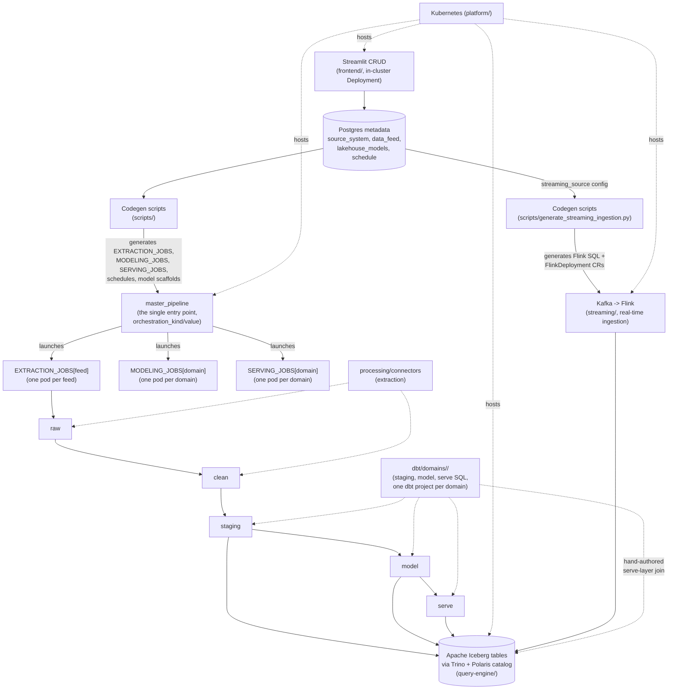

# data-platform

A metadata-driven lakehouse platform: Dagster orchestrates extraction and dbt/Trino transformations over Apache Iceberg tables, all running on Kubernetes — Dagster's own webserver/daemon, the Streamlit CRUD frontend, Postgres, Trino/Polaris/MinIO, and every pipeline run all run as real in-cluster workloads, not local processes. The goal is that onboarding a new source or table is mostly a matter of configuring metadata and writing business logic — not writing platform code.

See `Roadmap.md` for the full design history and phased build order, `Progress.md` for what's actually been built and verified, and `Backlog.md` for known gaps and deferred items. This README is the entry-level orientation; those files are the detailed record.

## Architecture

Five storage layers, one chain per feed: **raw** (verbatim durable copy) → **clean** (schema-validated) → **staging** (cumulative, upserted by business key) → **model** (Kimball facts/dimensions, SCD1/SCD2) → **serve** (query-facing views). A feed's `pipeline_steps` metadata can narrow this to extraction-only, or skip serving, etc. — resolved live per run by `master_pipeline`, the single entry point every trigger path (schedule, sensor, manual launch) goes through; it derives which feeds/domains to run from Postgres and launches each stage as its own independently-isolated pod (`EXTRACTION_JOBS`/`MODELING_JOBS`/`SERVING_JOBS`), never a nested child pod.

## Top-level folders

| Folder | Purpose |
|---|---|
| `metadata/` | The platform's own config database — Postgres DDL/init scripts and its Kubernetes manifests. Every other module reads from this DB; nothing here depends on another module. |
| `scripts/` | Build-time codegen: reads metadata and generates `EXTRACTION_JOBS`/`MODELING_JOBS`/`SERVING_JOBS`/`master_pipeline`, dbt model/snapshot scaffolds, dbt serve-layer views, and deletion-synthesis models. Also seeds the metadata DB. This is the platform's generation engine — rarely touched day-to-day. |
| `orchestration/` | The Dagster project — resources, hand-written assets for non-connector feeds, the dbt-assets integration, per-feed connector subclasses for bespoke extraction logic (e.g. REST pagination/flattening), and `k8s/` manifests for the in-cluster webserver/daemon/code-server Deployments. Consumes what `scripts/` generates. |
| `processing/connectors/` | The generic, reusable extraction connector framework — base classes and the standard connector kinds (Postgres/CSV/JSON file/REST) plus generic schema discovery. |
| `processing/raw_to_clean/` | Generic raw→clean validation logic (schema coercion against the metadata-tracked schema registry) — one shared module every feed's `clean` step uses. |
| `dbt/domains/<domain>/` | One compile-isolated dbt project per business domain — staging/model/serve SQL, plus macros copied in from `dbt/_shared/`. This is where most day-to-day modeling work happens. Each domain also gets its own Docker image, built/rebuilt independently of every other domain's. |
| `query-engine/` | Trino (compute) and Apache Polaris (Iceberg REST catalog) — config and Kubernetes manifests, no custom application code. |
| `streaming/` | Real-time ingestion: Kafka (KRaft, single broker) → Flink (Kubernetes Operator, one `FlinkDeployment` per active `streaming_source` row) → the same Iceberg warehouse everything else uses. Metadata-driven onboarding like a batch feed (`streaming_source` table + codegen), plus `streaming/testing/` — isolated, in-cluster tests proving each source end-to-end without needing the batch pipeline to have run first. |
| `frontend/` | Streamlit CRUD app for all metadata tables (source systems, feeds, lakehouse models, schedules, streaming sources) — a real in-cluster Deployment, `frontend/k8s/`. |
| `platform/` | Cluster-wide concerns not owned by any one module: the local kind cluster definition and Kubernetes namespaces. |
| `tests/` | Cross-module integration tests (as opposed to each module's own unit tests, which live inside that module). |

## Platform features: who's responsible

**User** = configures metadata (via the Streamlit CRUD app) and writes modeling/business logic (dbt SQL) within the platform's existing structure. **Developer** = changes the platform's own code — a new connector, new codegen behavior, new shared mechanics.

| Feature | Standard behavior (automatic) | User-generated | Developer-generated |
|---|---|---|---|
| Pipeline structure (`master_pipeline`, per-stage jobs, schedules, asset graph) | Fully codegen'd from metadata — never hand-authored | — | Changing how `scripts/generate_dagster_pipeline.py` codegens |
| Source/feed/model/schedule configuration | — | Streamlit CRUD forms | — |
| Extraction (source → raw → clean) for standard source shapes | Generic connectors (Postgres/CSV/JSON file/REST) handle fetch, schema validation, and durable write, all as one `EXTRACTION_JOBS[feed]` job | — | A new generic connector kind, or a bespoke per-feed subclass for pagination/flattening |
| Schema discovery & drift tracking | Fully automatic — inferred and versioned into `schema_registry` on every extraction | — | Changing discovery/diffing logic itself |
| Staging modeling (clean → staging) | Shared merge mechanics (`row_hash`, `classify_changes`) | The `stg_<feed>.sql` business-logic SELECT (columns, casts, joins) | — |
| Model-layer boilerplate (config, hashes, merge wrapper) | Scaffolded automatically for any new `lakehouse_models` row (`generate_model_scaffolds.py`) | — | Changing what the scaffold generates |
| Model-layer business logic (dimension/fact SELECTs) | — | The hand-filled `base` CTE in a scaffolded model/snapshot file | — |
| SCD Type 1 / Type 2 merge mechanics | Shared macros + dbt snapshot machinery, reused by every model | — | Changing the shared mechanics themselves |
| Deletion synthesis | Fully generated per `deletes_enabled` flag — no user code | — | Changing the generation logic |
| Serve layer — standard views (`_latest`/`_historical`) | Fully generated from `lakehouse_models`, zero code | — | Changing the view-generation template |
| Serve layer — custom views | — | Hand-authored views outside the generated subfolder | — |
| Cherry-picking (which pipeline steps run) | Resolved live from metadata, no code either way | Set via `pipeline_steps` on a feed or model | — |
| Run tracking / observability (`data_processing_runs`) | Fully automatic, written by every stage | — | Changing what's tracked or how |
